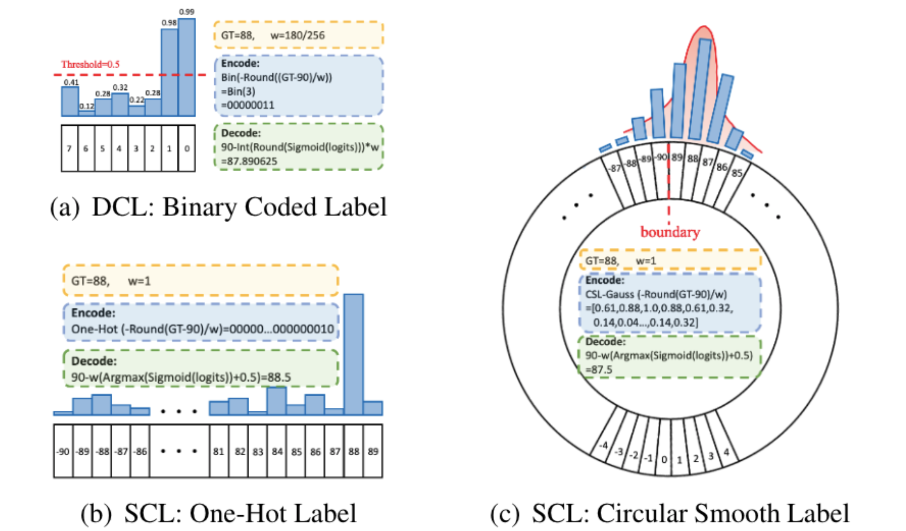
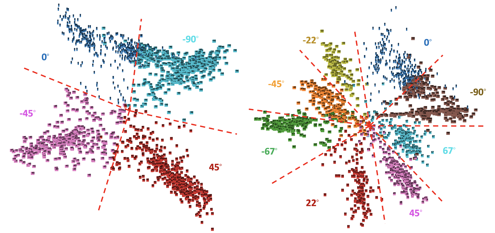
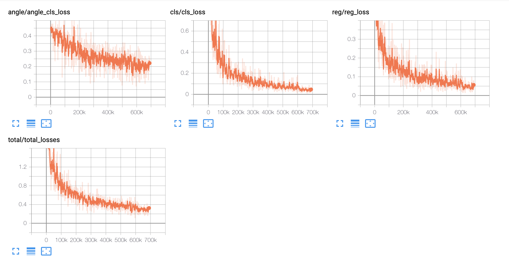

# Dense Label Encoding for Boundary Discontinuity Free Rotation Detection

[](https://opensource.org/licenses/Apache-2.0)
 [](https://arxiv.org/abs/2011.09670)

## Abstract
This repo is based on [Focal Loss for Dense Object Detection](https://arxiv.org/pdf/1708.02002.pdf), and it is completed by [YangXue](https://yangxue0827.github.io/).

**We also recommend a tensorflow-based [rotation detection benchmark](https://github.com/yangxue0827/RotationDetection), which is led by [YangXue](https://yangxue0827.github.io/).**

Techniques:     
- [x] [ResNet](https://arxiv.org/abs/1512.03385), [MobileNetV2](https://arxiv.org/abs/1801.04381), [EfficientNet](https://arxiv.org/abs/1905.11946)
- [x] [RetinaNet-H, RetinaNet-R](https://arxiv.org/abs/1908.05612)
- [x] [R<sup>3</sup>Det: Feature Refinement Module (FRM)](https://arxiv.org/abs/1908.05612)
- [x] [Circular Smooth Label (CSL)](https://arxiv.org/abs/2003.05597)
- [x] [Densely Coded Label (DCL)](https://arxiv.org/abs/2011.09670)
- [x] Dataset support: DOTA, HRSC2016, ICDAR2015, ICDAR2017 MLT, UCAS-AOD, FDDB, OHD-SJTU, SSDD++


## Pipeline


## Latest Performance
### DOTA1.0 (Task1)
| Model |    Backbone    |    Training data    |    Val data    |    mAP   | Model Link | Anchor | Angle Pred. | Reg. Loss| Angle Range | lr schd | Data Augmentation | GPU | Image/GPU | Configs |      
|:------------:|:------------:|:------------:|:---------:|:-----------:|:----------:|:-----------:|:-----------:|:-----------:|:---------:|:---------:|:---------:|:---------:|:---------:|:---------:|    
| [RetinaNet-H](https://arxiv.org/abs/1908.05612) | ResNet50_v1d 600->800 | DOTA1.0 trainval | DOTA1.0 test | 64.17 | [Baidu Drive (j5l0)](https://pan.baidu.com/s/1Qh_LE6QeGsOBYqMzjAESsA) | H | **Reg.** | smooth L1 | 180 | 2x | × | 3X GeForce RTX 2080 Ti | 1 | [cfgs_res50_dota_v15.py](./libs/configs/DOTA1.0/baseline/cfgs_res50_dota_v15.py) |
| [RetinaNet-CSL](https://arxiv.org/abs/2003.05597) | ResNet50_v1 600->800 | DOTA1.0 trainval | DOTA1.0 test | 65.69 | [Baidu Drive (kgr3)](https://pan.baidu.com/s/1gvkLhyoIMqVKWsSK38wyrw) | H | **Cls.: Gaussian (r=6, w=1)** | smooth L1 | 180 | 2x | × | 3X GeForce RTX 2080 Ti | 1 | [cfgs_res50_dota_v1.py](./libs/configs/DOTA1.0/csl/cfgs_res50_dota_v1.py) |
| [RetinaNet-DCL]() | ResNet50_v1 600->800 | DOTA1.0 trainval | DOTA1.0 test | 67.39 | [Baidu Drive (p9tu)](https://pan.baidu.com/s/1TZ9V0lTTQnMhiepxK1mdqg) | H | **Cls.: BCL (w=180/256)** | smooth L1 | 180 | 2x | × | 3X GeForce RTX 2080 Ti | 1 | [cfgs_res50_dota_dcl_v5.py](./libs/configs/DOTA1.0/dcl/cfgs_res50_dota_dcl_v5.py) |
| [RetinaNet-DCL]() | ResNet50_v1 600->800 | DOTA1.0 trainval | DOTA1.0 test | 67.02 | [Baidu Drive (mcfg)](https://pan.baidu.com/s/1sadSnSdQDjJyqSTJviWHdg) | H | **Cls.: GCL (w=180/256)** | smooth L1 | 180 | 2x | × | 3X GeForce RTX 2080 Ti | 1 | [cfgs_res50_dota_dcl_v10.py](./libs/configs/DOTA1.0/dcl/cfgs_res50_dota_dcl_v10.py) |
| [RetinaNet-DCL]() | ResNet152_v1 **600->MS** | DOTA1.0 trainval | DOTA1.0 test | 73.88 | [Baidu Drive (a7du)](https://pan.baidu.com/s/1J9gmrYLINfjtgDkVAqp-Ww) | H | **Cls.: BCL (w=180/256)** | smooth L1 | 180 | 2x | √ | 3X GeForce RTX 2080 Ti | 1 | [cfgs_res152_dota_dcl_v1.py](./libs/configs/DOTA1.0/dcl/cfgs_res152_dota_dcl_v1.py) |
| **[Refine-DCL]()** | ResNet50_v1 600->800 | DOTA1.0 trainval | DOTA1.0 test | 70.63| [Baidu Drive (6bv5)](https://pan.baidu.com/s/1IlIjK6NLPQfLqMnPo7p6sw) | H->R | **Cls.: BCL (w=180/256)** | iou-smooth L1 | 90->180 | 2x | × | 3X GeForce RTX 2080 Ti | 1 | [cfgs_res50_dota_refine_dcl_v1.py](./libs/configs/DOTA1.0/r3det_dcl/cfgs_res50_dota_refine_dcl_v1.py) |
| **[R<sup>3</sup>Det-DCL]()** | ResNet50_v1 600->800 | DOTA1.0 trainval | DOTA1.0 test | 71.21 | [Baidu Drive (jueq)](https://pan.baidu.com/s/1XR31i3T-C5R16giBxQUNWw) | H->R | **Cls.: BCL (w=180/256)** | iou-smooth L1 | 90->180 | 2x | × | 3X GeForce RTX 2080 Ti | 1 | [cfgs_res50_dota_r3det_dcl_v1.py](./libs/configs/DOTA1.0/r3det_dcl/cfgs_res50_dota_r3det_dcl_v1.py) |
| **[R<sup>3</sup>Det-DCL]()** | ResNet152_v1 600->MS (+Flip) | DOTA1.0 trainval | DOTA1.0 test | 76.70 (+0.27) | [Baidu Drive (2iov)](https://pan.baidu.com/s/1UVcCrhcUwTFvWpJaoIToCA) | H->R | **Cls.: BCL (w=180/256)** | iou-smooth L1 | 90->180 | 4x | √ | 4X GeForce RTX 2080 Ti | 1 | [cfgs_res152_dota_r3det_dcl_v1.py](./libs/configs/DOTA1.0/r3det_dcl/cfgs_res152_dota_r3det_dcl_v1.py) |

<!-- **Notice:**      -->
<!-- **Please refer to [new repo](https://github.com/Thinklab-SJTU/R3Det_Tensorflow) for the latest progress.** -->

### Visualization


## My Development Environment
**docker images: docker pull yangxue2docker/yx-tf-det:tensorflow1.13.1-cuda10-gpu-py3**      
1、python3.5 (anaconda recommend)               
2、cuda 10.0                     
3、[opencv(cv2)](https://pypi.org/project/opencv-python/)       
4、[tfplot 0.2.0](https://github.com/wookayin/tensorflow-plot) (optional)            
5、tensorflow-gpu 1.13                              

## Download Model
### Pretrain weights
1、Please download [resnet50_v1](http://download.tensorflow.org/models/resnet_v1_50_2016_08_28.tar.gz), [resnet101_v1](http://download.tensorflow.org/models/resnet_v1_101_2016_08_28.tar.gz), [resnet152_v1](http://download.tensorflow.org/models/resnet_v1_152_2016_08_28.tar.gz), [efficientnet](https://github.com/tensorflow/tpu/tree/master/models/official/efficientnet), [mobilenet_v2](https://storage.googleapis.com/mobilenet_v2/checkpoints/mobilenet_v2_1.0_224.tgz) pre-trained models on Imagenet, put it to data/pretrained_weights.       
2、**(Recommend in this repo)** Or you can choose to use a better backbone (resnet_v1d), refer to [gluon2TF](https://github.com/yangJirui/gluon2TF).    
* [Baidu Drive](https://pan.baidu.com/s/1GpqKg0dOaaWmwshvv1qWGg), password: 5ht9.          
* [Google Drive](https://drive.google.com/drive/folders/1BM8ffn1WnsRRb5RcuAcyJAHX8NS2M1Gz?usp=sharing)      

## Compile
```  
cd $PATH_ROOT/libs/box_utils/cython_utils
python setup.py build_ext --inplace (or make)

cd $PATH_ROOT/libs/box_utils/
python setup.py build_ext --inplace
```

## Train 

1、If you want to train your own data, please note:  
```     
(1) Modify parameters (such as CLASS_NUM, DATASET_NAME, VERSION, etc.) in $PATH_ROOT/libs/configs/cfgs.py
(2) Add category information in $PATH_ROOT/libs/label_name_dict/label_dict.py     
(3) Add data_name to $PATH_ROOT/data/io/read_tfrecord_multi_gpu.py  
```     

2、Make tfrecord     
For DOTA dataset:      
```  
cd $PATH_ROOT/data/io/DOTA
python data_crop.py
```  

```  
cd $PATH_ROOT/data/io/  
python convert_data_to_tfrecord.py --VOC_dir='/PATH/TO/DOTA/' 
                                   --xml_dir='labeltxt'
                                   --image_dir='images'
                                   --save_name='train' 
                                   --img_format='.png' 
                                   --dataset='DOTA'
```      

3、Multi-gpu train
```  
cd $PATH_ROOT/tools
python multi_gpu_train_dcl.py
```

## Test
```  
cd $PATH_ROOT/tools
python test_dota_dcl_ms.py --test_dir='/PATH/TO/IMAGES/'  
                           --gpus=0,1,2,3,4,5,6,7  
                           -ms (multi-scale testing, optional)
                           -s (visualization, optional)
``` 

**Notice: In order to set the breakpoint conveniently, the read and write mode of the file is' a+'. If the model of the same #VERSION needs to be tested again, the original test results need to be deleted.**      

## Feature Visualization
```  
cd $PATH_ROOT/tsne
python feature_extract_dcl.py
```

```  
python tsne.py
```

```  
cd $PATH_ROOT/tsne/dcl_log
tensorboard --logdir=.
```



## Tensorboard
```  
cd $PATH_ROOT/output/summary
tensorboard --logdir=.
``` 




## Citation

If this is useful for your research, please consider cite.

```
@article{yang2020dense,
    title={Dense Label Encoding for Boundary Discontinuity Free Rotation Detection},
    author={Yang, Xue and Hou, Liping and Zhou, Yue and Wang, Wentao and Yan, Junchi},
    journal={arXiv preprint arXiv:2011.09670},
    year={2020}
}

@article{yang2020arbitrary,
    title={Arbitrary-Oriented Object Detection with Circular Smooth Label},
    author={Yang, Xue and Yan, Junchi},
    journal={European Conference on Computer Vision (ECCV)},
    year={2020}
    organization={Springer}
}

@article{yang2019r3det,
    title={R3Det: Refined Single-Stage Detector with Feature Refinement for Rotating Object},
    author={Yang, Xue and Liu, Qingqing and Yan, Junchi and Li, Ang and Zhang, Zhiqiang and Yu, Gang},
    journal={arXiv preprint arXiv:1908.05612},
    year={2019}
}

@inproceedings{xia2018dota,
    title={DOTA: A large-scale dataset for object detection in aerial images},
    author={Xia, Gui-Song and Bai, Xiang and Ding, Jian and Zhu, Zhen and Belongie, Serge and Luo, Jiebo and Datcu, Mihai and Pelillo, Marcello and Zhang, Liangpei},
    booktitle={Proceedings of the IEEE Conference on Computer Vision and Pattern Recognition (CVPR)},
    pages={3974--3983},
    year={2018}
}

```

## Reference
1、https://github.com/endernewton/tf-faster-rcnn   
2、https://github.com/zengarden/light_head_rcnn   
3、https://github.com/tensorflow/models/tree/master/research/object_detection    
4、https://github.com/fizyr/keras-retinanet     


